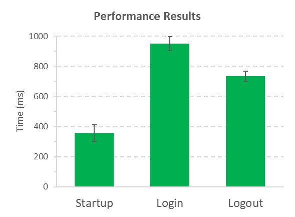

# performance-total


With this plugin for [webdriver.io](https://webdriver.io/) you can easily add performance analysis to any flow in your tests.

<h2>Installation</h2>
The easiest way to install this module as a (dev-)dependency is by using the following command:

```
npm install wdio-performancetotal-service --save
```
Or:

```
npm install wdio-performancetotal-service --save-dev
```

<h2>Usage</h2>

Add wdio-performancetotal-service to your `wdio.conf.js`:

```
exports.config = {
  // ...
  services: ['performancetotal']
  // ...
};
```
...or with the service options:

```
exports.config = {
  // ...
  services: [
      ['performancetotal',
      // The options (with default values)
        {
            disableAppendToExistingFile: false,
            performanceResultsFileName: "performance-results",
            dropResultsFromFailedTest: false,
            performanceResultsDirectory: "performance-results"
        }]
      ]
  // ...
};
```

<h2>Options</h2>

<h3>disableAppendToExistingFile</h3>

When set to `true`, new test runs or tests from another spec file will overwrite any existing performance data.
When set to `false` (default), performance data will be added to the existing data.

<h3>performanceResultsFileName</h3>

You can set the default results file name (`performance-results`).
A newly created results file normally overwrites the old file. If you want to keep old files, it is recommended to add a timestamp to the file name. For example:

```
...
performanceResultsFileName: `performance-results_${new Date().getTime()}`
...
```

<h3>dropResultsFromFailedTest</h3>

Default is `false`. When the value is set to `true`, performance analysis from failed tests would be excluded.

<h3>performanceResultsDirectory</h3>
You can override the default path for the results directory in the project's root dir.
For example:

```
...
performanceResultsFileName: "results-dir/performance-total-results"
...
```


<h2>Usage in test</h2>

Just import <b>performancetotal</b> where you need it, whether it be your test file or any other class:

```
import { performancetotal } from "wdio-performancetotal-service";

it("should test github startup performance", () => {
            // ...
            performancetotal.sampleStart("Startup");
            
            browser.url("https://github.com/");
            
            performancetotal.sampleEnd("Startup");
            //...
        });
```


<h2>Getting the results</h2>

A new results directory (the default directory name is `performance-results`) is created in your project's root folder and when all the tests are completed two files are created inside it: `performance-results.json` and `performance-results.csv`. The analyzed data includes: average time, standard error of mean(sem), number of samples, min value, max value, earliest time and latest time.

<h2>Typescript support</h2>

Typescript is supported for this plugin.